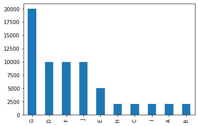
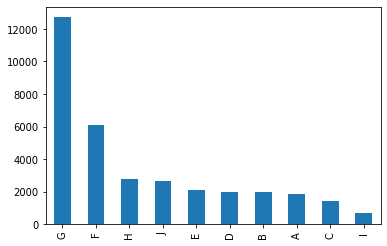

# I - Conceptual Questions
## Would you rather have too many false positives, or too many false negatives? Explain.
<font size="3">The question relates also to the exercice part (as we see further). In a typicall system taking decision in production usually one cares about its precision, i.e. among the items classified as positive how many are correctly classified. The number of false positives would measure how many are wrongly classified, in other words the more false positive we have less the precision of the system is. On the other hand, the real positives are either correctly classified by the system or wrongly in which case they are false negatives. Therefore, too many false negatives means the system is recovering few of the items it could. As the precision of the sytem increases, as it gets more strict about its decision to assign positive labels, and as its recall decreases. Depending on the system one may give more importance to precision, or recall. In practise, the business unit has to define based on the product at hand the level of requirement. In the remainder, we will see that to put the categorizer in production we suggest a precision level of  99%. That's of course hypothetical and based on our assumptions of how the categorizer will be used in production.</font>

## Give an example from your work experience of selection bias. Was it important? In general, how can you avoid it?
<font size="3">Selection bias is of course crucial as it may introduce a difference between offline metrics as typically measured on a test set, and online metrics when running an A/B test. This can typically happen when you have for example a recommender system running in production such that sampling directly from the data observed in production leads to a bias of selection imposed by the recommender system. Imagine that the recommender system is flowed, and never suggest any item from class A, this may lead if we are not carefull to produce a training data set without any item from class A since its never displayed by the system in production.

In the context of this exercice for instance, we are given  a training set, and a test set but nothing is said about how this data is selected. As we will see further, the class distributions are very different between training and test and indicate a selection procedure especially on the training (stratified sampling as indicated by round numbers). It's very likely that the person who produced the training data sampled each category in a specific way to ensure all categories are present in the training set at sufficent level (this is typicall in ML), even though the real observed distribution differs (it may be that the test set follow the real distribution, but we have not enough information to be assertive on this). 

To avoid selection bias, one have to use different selection strategy, as stratified sampling based on specific features as category, or CTR, etc. The idea would be to cover all cases that may lead to a bias. Another technique would consist of introducing randomization in the production system. For instance, one way could be to sample the recommendation based on the probability score and so always give the chance to not recommended items to still show up. 

As with regards to my personal experience, in the context of designing a relevance model for search, the sampling mechanism used to extract a training set and test set was very critical. For instance, it was important to sample random cases that normally appear rarely in production due to a selection bias, otherwise when such examples do happen even if rarely they may go through the filtering and eventually ending up to be shown just because the model has never been trained on such rare examples that could ruin the user exeperience.  More information on this project in : 
```
Aiello, L., Arapakis, I., Baeza-Yates, R., Bai, X., Barbieri, N., Mantrach, A. and Silvestri, F., 2016, October. The role of relevance in sponsored search. In Proceedings of the 25th ACM International on Conference on Information and Knowledge Management (pp. 185-194). ACM.
```


## What is the difference between Bayesian Estimate and Maximum Likelihood Estimation (MLE)? Can you think of an example where Bayesian estimate is the most appropriate method? Another example in which MLE is the most appropriate method?</font>
<font size="3">in MLE one would usually directly maximize the likelihood of a class, or its conditional likelihood in order to infer a model (values of parameters). A typical example is when training a logistic regression model that consists of finding the parameter values that maximize the conditional likelihood of the data. This is very appropriate when we have enough data, such that each feature is correctly estimated. However, when we do not have enough data  (leading to the parameters estimation to lack confidence) one would rather use a bayesian approach. In that context, we usually have a believe (for instance on parameter values) that come in form of a prior distribution. By so doing, one can take decision based on an evidence that is marginalized on the full distribution of the parameter set and hence account better for the variance of the estimates. A simple way to see this is that if you consider a normal prior, as one starts having more and more data, confidence increases and leads to nearly a null variance, in which case an MLE is great. However, for the lack of data case, the prior believe will smoothen the decision to avoid a wrong estimation based on few observations. In practise, a Bayesian model can be very effective for the long tail and rare events, while the MLE would work fine on the head (which if we are facing a power law as is usually the case will cover 80 to 90% of the domain).</font>

## II - Conceptual Problem
<font size="3"> We are given the average performance of 2 stores in $, along with the stand. deviation and the number of points of which both measure are calculated. If we make the hypothesis, that the performance follow a normal distribution we can easily derive a confidence interval to compare both scores with a 95\% confidence. </font>

```python
import numpy as np
import scipy.stats


def confidence_interval(m, std, n, confidence=0.95):
    ci_1, ci_2 = scipy.stats.norm.interval(confidence, loc=0, scale=1)
    h = (ci_1*std/(n**(0.5)))
    return m-h, m, m+h
    
first_store = confidence_interval(800000,100000,50)
print(first_store)
second_store= confidence_interval(780000,30000,50)
print(second_store)

```
```
(827718.0764869936, 800000, 772281.9235130064)
(788315.422946098, 780000, 771684.577053902)
```
We firt notice, that both confidence intervals overlap therefore we can not conclude that one performs better. We confirm this as well with a simple t-test, where we try to reject the null hypothesis of mean equalities of the population

```python
import numpy as np
from scipy import stats

def stat_test_diff_normal(mean_a , std_a, mean_b, std_b, N ):
    var_a = std_a**2
    var_b = std_b**2
    N = 50
    s = np.sqrt((var_a + var_b)/2)
    ## Calculate the t-statistics
    t = (mean_a - mean_b) /(s*np.sqrt(2/N))
    ## Compare with the critical t-value
    #Degrees of freedom
    df = 2*N - 2
    #p-value after comparison with the t 
    p = 1 - stats.t.cdf(t,df=df)
    return 2*p 

print(f" p-value = {stat_test_diff_normal(800000,100000,780000,30000, 50)}")
```
```
p-value = 0.17866908114208235
```

# III. Practical Problem
<font size="3">
It is asked to design a classification pipeline in the context of a business decision for classifying similar new articles. We start by analyzing the existing data set, before discussing assumptions, and derive solutions that we implement for the problem
</font>

# Business Understanding - What is the problem
## Questions one should answer to design a Text Classifier in production

<font size="3">The important question one should ask in order to design a text classifier system to be put in production is:
</font>

### (a) What is the scale of training set:

<font size="3"> When a system is put in production one has to keep in mind that the pipeline should be fully automatized, and the training should be done each time additional annotated data are collected and injected in the system. In our problem however, we are facing a dataset for which very likely the annotations are done by human editors. That means that the speed of annotations will remain small and hence we should expect a small scale in terms of number of training samples --- some millions of samples maximum. 
</font>

### (b) How often should the system be (re)trained and how:

<font size="3"> As explained earlier, since we are dealing with human annotations the pace of retraining will be dictated by the rythm at which new annotations comes in. We can easely make the assumption that we will get new annotations to be added to production once a week. In other word, we could envisage heavy learning systems that will take up to 1 week for training.
</font>

### (c) Life-cycle of the training and test set:

<font size="3"> In the real world, the training and test set will be evolving, mostly to keep injecting new examples not covered 
well so far. To do so, one will generally select news articles by relying on metrics as their popularity and make sure that the most popular articles are perfectly well covered, and check performance specifically on the part of the traffic that matters. Many times, metrics are not well designed, or do not reflect the reality of the traffic that matters. On top of that, the performance should be analyzed on the torso, and tail of the category distribution as the system keep improving.
During that cycle, false positives, and false negatives should be discussed along with the annotation team, and additional example should be extracted (using keyword search for instance) that resemble to the false positives and false negatives and used to improve the training set, and test set.
</font>

### (d) Serving at runtime or Offline:


<font size="3"> This question is crucial, as very likely if the model will be used online for serving the maximum time allowed for a score prediction for all classes is a maximum of few ms. This is not necessarly the case if the automatic annotations is done by an offline job, in which case we can consider  heavy models. In the remainder, we consider that the categorization are done by an offline job that populates a database, and would consider issues related to serving a model at runtime out of the scope of this assignement, however we remain open to discuss them if needed.</font>

    
### (e) Infra-cost vs Accuracy in the context of Business metrics
<font size="3">For instance, we could imagine a hadoop spark job that will run an estimator on each news feed into the system, in this last case our constraints are mostly how many news do we need to categorize, and what is the (infra)-cost we are ready to incur for it. This comes typically with a trade-off between computing time (and infra-cost) versus accuracy. So, one would need to run experiments offline to analyze the win in performance of running heavy models (for instance BERT), and the extent to which the final business metrics benefit of it.
</font>

# Business Understanding - What is available / What does a solution look like

<font size="3">Having highlighted  the main aspect of problems, let's see what is given to us. Basically, we are provided with two json files, rouglhy small (65000 samples for the training, 34171 sample in the test, 10 Categories). What we propose is to first start with a simple baseline relying on Bag-Of-Words modeling, using a logistic regression. We propose to go through the exercice using this first modeling, and iteratively see what drives the performance (in terms of the features), and then tunning the model. We wil then propose additional steps to go beyond a simple logistic and see what are the pros and cons of such a choice.</font>


# Technology choices

<font size="3">For data preparation we decide to use pandas as it is a fast way to load the data and do cleaning operation on it, as check for Nans values, be sure the intersection between Training and Test is void, having a look at the category distribution. Also, since the dataset is pretty small this can be done directly on the laptop itself. Also, pandas interface well with numpy, scikit, and keras that we will use as a machine learning tools for this project. They allow us to easily train and test models as logistic regression, and neural networks, and also do hyperparameter tunning using internal cross validation. They will also provide facilities for plotting, and computing metrics (as accuracy for example).</font>


# Data Preparation

## Load data set. 

```python
import pandas as pd
import os
%matplotlib inline
import matplotlib.pyplot as plt
datafilename_train = "News_category_train.json"
datafilename_test = "News_category_test.json"
path_to_file = "../datasets/"
data_train = pd.read_json(os.path.join(path_to_file,datafilename_train))
data_test = pd.read_json(os.path.join(path_to_file,datafilename_test))
```
## check if any column of the dataset  is missing
```python
print(f"Is there any missing value in the training data set: {data_train.isnull().values.any()}")
print(f"Is there any missing value in the test data set: {data_test.isnull().values.any()}")
```
```
Is there any missing value in the training data set: False
Is there any missing value in the test data set: False
```
## Check the distribution of the classes in Training and Test
```python
data_train.category.value_counts().plot(kind='bar')
```


```python
data_test.category.value_counts().plot(kind='bar')
```


## Remarks on the sampling of the training set and test set: 

<font size="3"> Clearly the training data set have been sampled in a specific way, i.e. stratified sampling, with some categories more represented. We see a clear difference in the distributions of the training set vs test set. 

In the remainder, we consider the hypothesis that the class distribution induced by the test dataset is the one that matters for the business. 
</font>

### Check Training is fully different from Test

<font size="3">  We see there is three points in the test already in training. This is not necessarly wrong, many machine learning problem have to deal with already encountered examples, for instance CTR prediction of well know query-ads pairs. However, in the remainder we consider that we want to consider the extent to which we can generalize on unseen examples. Hence, we remove from the training these three points. </font>

```python
from pandas import DataFrame
def retain_unseen_example_in_test(df_train: DataFrame, df_test: DataFrame) -> DataFrame:
    return df_train.merge(df_test, how='left', indicator=True).loc[lambda x: x['_merge'] != 'both']

print(f"number of rows before filtering {data_train.shape[0]}")
data_train = retain_unseen_example_in_test(data_train,data_test)
print(f"number of rows after filtering {data_train.shape[0]}")
```
```
number of rows before filtering 65000
number of rows after filtering 64997
```
<font size="3"> We removed 3 examples from the training already in the test </font>

## Start with a simple and strong Baseline ( or BOW Logistic Regression baseline)
<font size="3"> If one aim to have ML in production, the prefered operational way is to start with a simple but effective model, make all the components of the pipeline work, AB test, and roll out. Only when this is done, one could consider improving over this. Keep in mind the 80\20 rule, with 20% of the effort on many problem one can reach 80% of the results. In this line, we propose to start with a simple BOW Logistic Regression
</font>

### Extract the Text into Arrays

```python
from typing import List
from pandas import Series
def get_text_array(df: DataFrame, feature_list: List[str]) -> Series:
    return_df = df[feature_list[0]]
    if len(feature_list) > 1:
        for f in feature_list[1:]:
            return_df += ' ' + df[f]
    return return_df.values
```
<font size="3"> Notice that there are different metadata available for each news, the headline, the short description, the list of authors, and even the link to the news. 
Let's check first by using a simple TFIDF BOW model(i.e. word unigrams and bigrams vector space), with a Logistic Regression with default parameter (we check the tunning later on), how each group of features matters </font>


### One example metadata

```python
data_train.iloc[0]
```
```
authors                                                Priscilla Frank
category                                                             A
headline             'Rice-Ko' Is What Happens When Artists Recreat...
link                 https://www.huffingtonpost.com/entry/artists-r...
short_description    And it's all a delicious homage to a 1950s art...
_merge                                                       left_only
Name: 0, dtype: object
```


<font size="3">In the remainder we will not focus on the link eventhough one could consider using the link it self as feature, or go beyond that by crawling the landing page. We let this as future exercice. 

Let's build a  first simple TFIDF BOW model(i.e. word unigrams and bigrams vector space), with a Logistic Regression with default parameter (we check the tunning later on).
</font>

```python
from numpy import array
from typing import List
from sklearn.feature_extraction.text import TfidfVectorizer
from sklearn.linear_model import LogisticRegression

def evaluate_logistic(data_train: array,
                      data_test: array,
                      columns_group: List[List[str]]):

    vectorizer = TfidfVectorizer(stop_words='english', analyzer='word',
                             ngram_range=(1, 2), min_df=3, lowercase=True)
    
    Ytrain = data_train['category'].values
    Ytest = data_test['category'].values
    classifier = LogisticRegression(max_iter=500,
                                        random_state=1)
    
    for columns in columns_group:
        
        x_train_array = get_text_array(data_train, columns)
        x_test_array = get_text_array(data_test, columns)
        vectorizer.fit(x_train_array)
        Xtrain = vectorizer.transform(x_train_array)
        Xtest = vectorizer.transform(x_test_array)

        # LOGISTIC BASELINE DEFAULT PARAMETER

        classifier.fit(Xtrain, Ytrain)
        score = classifier.score(Xtest, Ytest)
        print(f"Accuracy on {columns} is {score}")

groups_of_features = [
            ['headline'],
            ['short_description'],
            ['authors'],
            ['headline', 'authors'],
            ['short_description', 'authors'],
            ['headline', 'short_description'],
            ['headline', 'short_description', 'authors']]

evaluate_logistic(data_train,
                      data_test,groups_of_features)
                      
```
```
Accuracy on ['headline'] is 0.7463346112200404
Accuracy on ['short_description'] is 0.6182142752626496
Accuracy on ['authors'] is 0.674811975066577
Accuracy on ['headline', 'authors'] is 0.8237979573322408
Accuracy on ['short_description', 'authors'] is 0.751924146205847
Accuracy on ['headline', 'short_description'] is 0.844722132802669
Accuracy on ['headline', 'short_description', 'authors'] is 0.8438734599514208
```

Using the current code base, you can also directly run the command:
```
python bow-keras.py --logistic_baseline
```

<font size="3"> We observe that when using all the features we improve, even though the metadata "authors" is not fundamental since no significant improvement is observed. </font>

## Tuning the baseline
<font size="3"> It's important to tune well the regularization parameters of the logistic regression to reach good performance. This is what we do now, by looking for the best l2 regularization scheme </font>

```python
import numpy as np
import scipy.stats
from scipy.stats import uniform
from sklearn.model_selection import RandomizedSearchCV


def tune_logitstic(data_train: array,
                   data_test: array,
                   columns: List[str]):
    x_train_array = get_text_array(data_train, columns)
    x_test_array = get_text_array(data_test, columns)

    vectorizer = TfidfVectorizer(stop_words='english', analyzer='word',
                                 ngram_range=(1, 2), min_df=3, lowercase=True)
    vectorizer.fit(x_train_array)
    Xtrain = vectorizer.transform(x_train_array)
    Xtest = vectorizer.transform(x_test_array)
    Ytrain = data_train['category'].values
    Ytest = data_test['category'].values
    # LOGISTIC BASELINE DEFAULT PARAMETER
    classifier = LogisticRegression(max_iter=500)
    # Create regularization penalty space

    # Create regularization hyperparameter distribution using uniform distribution

    params = dict(
        penalty=['l2'],
        C=uniform(loc=0, scale=4))
    search = RandomizedSearchCV(classifier,
                                params, random_state=123456789,
                                n_iter=100, cv=5, verbose=0, n_jobs=-1)

    search_result = search.fit(Xtrain, Ytrain)

    # Evaluate testing set using the best estimator
    test_accuracy = search.score(Xtest, Ytest)

    print("Best: %f using %s" % (search_result.best_score_, search_result.best_params_))

    means = search_result.cv_results_['mean_test_score']
    stds = search_result.cv_results_['std_test_score']
    params = search_result.cv_results_['params']
    for mean, stdev, param in zip(means, stds, params):
        print("%f (%f) with: %r" % (mean, stdev, param))

    print(f'Best Accurcacy {search_result.best_score_}\n' +
          f'Best Param {search_result.best_params_}\n' +
          f'Test Accuracy {test_accuracy} ')
    

group = ['headline', 'short_description', 'authors']
tune_logitstic(data_train, data_test, group)

```

Or run the command:
```
python bow-keras.py --tune_logistic
```
```
Best Param {'C': 3.831032901277876, 'penalty': 'l2'}
Test Accuracy 0.8598519212197477
```

This is an improvement of 1.89% of over the none tuned version.

## Going Deep tuning a Neural Net

<font size="3"> Let's see if we can win some performance by going Deep. Keep in mind that this will be at the cost of the explainability of the model, indeed a logistic assign weight to each words and hence one could easily understand how a specific score is computed. Also, when going to DNN one will need to use a specific library at inference time which could be difficult depending on available platform, in the other hand a logistic inference can easely be implemented an consists only of a dot product and a sigmoid.</font>

```python
def create_nn_model(dropout: float,
                    input_dim: int,
                    output_dim: int,
                    hidden_units: str,
                    ) -> Model:
    hidden_units = hidden_units.split('_')
    model = Sequential()
    for units in hidden_units:
        model.add(layers.Dense(int(units), input_dim=input_dim, activation='relu'))
        model.add(layers.Dropout(dropout))
    # final layer
    model.add(layers.Dense(output_dim, activation='sigmoid'))
    model.compile(optimizer='adam',
                  loss='categorical_crossentropy',
                  metrics=['accuracy'])
    model.summary()
    return model


# EXTRACT TF-IDF BOW ARRAY
columns = ['headline', 'short_description', 'authors']
x_train_array = get_text_array(data_train, columns)
x_test_array = get_text_array(data_test, columns)
vectorizer = TfidfVectorizer(stop_words='english', analyzer='word',
                             ngram_range=(1, 2), min_df=3, lowercase=True)
vectorizer.fit(x_train_array)
Xtrain = vectorizer.transform(x_train_array)
Xtest = vectorizer.transform(x_test_array)

# ONE HOT ENCODING OF CLASSES FOR DNN

Ytrain = get_one_hot_class(data_train)
Ytest = get_one_hot_class(data_test)
# NEURAL NET 1 LAYER
# DEFINE GRID SEARCH PARAMETERS NN. ARCHI
param_grid = dict(dropout=[0.1, 0.2],
                  input_dim=[Xtrain.shape[1]],
                  output_dim=[Ytrain.shape[1]],
                  hidden_units=['10', '10_10', '100_100_100',
                                '20', '20_20', '20_20_20',
                                '100', '100_100', '100_100_100',
                                '500', '500_500', '500_500_500'],
                  nb_epoch=[3, 4, 5],
                  batch_size=[32],
                  )

model = KerasClassifier(build_fn=create_nn_model)
grid = GridSearchCV(estimator=model,
                    param_grid=param_grid,
                    cv=2,
                    n_jobs=-1,
                    verbose=0)
grid_result = grid.fit(Xtrain, Ytrain)
```

Or
```
python bow-keras.py --nn
```

```
Best Param {'batch_size': 32, 'dropout': 0.1, 'hidden_units': '100_100', 'input_dim': 78637, 'nb_epoch': 4, 'output_dim': 10}
Test Accuracy 0.8714114427566528 
```
<font size="3">This allowed us to identify a specific NN structure, and droupout parameter tuned  internally on the training set, that outperform the logistic by reaching 0.8714 accuracy </font>

To export the neural model of the best configuration please run:
``` 
python bow-keras.py --export_nn
```
This will train the model, save it in the models directory, and return its accuracy on the test set. Please do this step before trying to load the model further.

# Productization Plan

## Level of acceptability of production

<font size="3">In order to start tagging our news, we need to check with the business the extent to which the produced tag are good enough to be put into production. Accuracy is not good enough as it is averaged on all classes. We can consider each class individually, and measure precision, and recall for each of the classes. We can check with the business what is the level of false positive accetpable (for instance 0.1%, or 0.01% of record can be wrongly classified). Then, using a set of annotation of the class, we can determine what is the threshold value (i.e. probability of the class |x in case of logistic, or cross entropy based models) over which we consider the element to belong to the class. So the first step will be to infer this.</font>

## Load best model (NN)

```python
from keras.models import load_model

droupout = 0.1
archi = '100_100'
epochs = 1
batch_size = 32
nn_model = load_model(f'DNN_dropout_{droupout}_archi_{archi}_epochs_{epochs}_batchsize_{batch_size}')

```

## Precision and Recall at class level based on arg_max class assignement
If we would assign the category with the best class we measure the following individual class level precision and recall
```
class recall of category 0 is 0.792
class precision of category 1 is 0.798
class recall of category 1 is 0.730
class precision of category 2 is 0.745
class recall of category 2 is 0.619
class precision of category 3 is 0.686
class recall of category 3 is 0.834
class precision of category 4 is 0.912
class recall of category 4 is 0.915
class precision of category 5 is 0.946
class recall of category 5 is 0.949
class precision of category 6 is 0.889
class recall of category 6 is 0.930
class precision of category 7 is 0.872
class recall of category 7 is 0.630
class precision of category 8 is 0.583
class recall of category 8 is 0.679
class precision of category 9 is 0.827
class recall of category 9 is 0.918
```


<font size="3"> As one can see some classes have a pretty low precision, for category 8 were we will end up with wrong assignement more than 41% of the cases. This is of course not acceptable. 
In general, it will be better to discuss with the business what level of wrong assignement are tolerated (i.e. false positives), and calibrate the system in consequences. Let's say for instance that we want a precision of 99% or 95% for all classes. </font>

We can compute it by
```python
    test_prediction = nn_model.predict(Xtest)
    GT = pd.DataFrame(LabelEncoder().fit_transform(data_test['category']).transpose())
    Scores = pd.DataFrame(test_prediction)
    PR = pd.DataFrame(Scores.idxmax(axis=1))
    for category_idx in set(LabelEncoder().fit_transform(data_train['category'])):
        print(f"class precision of category {category_idx} is "
              f"{len(PR[PR[0] == category_idx][GT[0] == category_idx]) / len(PR[PR[0] == category_idx]):.3f}")
        print(f"class recall of category"
              f" {category_idx} is "
              f"{len(PR[PR[0] == category_idx][GT[0] == category_idx]) / len(GT[GT[0] == category_idx]):.3f}")

    for operation_level in  operation_levels:
        print(f'THRESHOLD TO OPERATE AT {operation_level}% PRECISON LEVEL')
        eps = 1.e-9
        for category_idx in set(LabelEncoder().fit_transform(data_train['category'])):
            for threshold in range(0, 100):
                threshold *= 0.01
                tp = len(GT[0][Scores[category_idx] > threshold][GT[0][Scores[category_idx] > threshold] == category_idx])
                fp = len(GT[0][Scores[category_idx] > threshold][GT[0][Scores[category_idx] > threshold] != category_idx])
                tn = len(GT[0][Scores[category_idx] < threshold][GT[0][Scores[category_idx] < threshold] != category_idx])
                fn = len(GT[0][Scores[category_idx] < threshold][GT[0][Scores[category_idx] < threshold] == category_idx])
                precision = tp / (tp + fp + eps)
                recall = tp / (tp + fn + eps)
                if precision >= operation_level:
                    print(
                        f"precision: {precision:.3f} "
                        f"recall: {recall: .3f} "
                        f"threshold: {threshold: .3f} "
                        f"category: {category_idx}")
                    break
```

```
THRESHOLD TO OPERATE AT 0.99% PRECISON LEVEL
precision: 0.991 recall:  0.509 threshold:  0.390 category: 0
precision: 1.000 recall:  0.039 threshold:  0.800 category: 1
precision: 0.991 recall:  0.077 threshold:  0.690 category: 2
precision: 0.993 recall:  0.142 threshold:  0.940 category: 3
precision: 0.990 recall:  0.343 threshold:  0.970 category: 4
precision: 0.990 recall:  0.803 threshold:  0.460 category: 5
precision: 0.990 recall:  0.510 threshold:  0.700 category: 6
precision: 1.000 recall:  0.005 threshold:  0.780 category: 7
precision: 1.000 recall:  0.018 threshold:  0.700 category: 8
precision: 0.990 recall:  0.302 threshold:  0.770 category: 9
THRESHOLD TO OPERATE AT 0.95% PRECISON LEVEL
precision: 0.956 recall:  0.715 threshold:  0.120 category: 0
precision: 0.959 recall:  0.191 threshold:  0.640 category: 1
precision: 0.961 recall:  0.105 threshold:  0.660 category: 2
precision: 0.952 recall:  0.372 threshold:  0.820 category: 3
precision: 0.950 recall:  0.837 threshold:  0.350 category: 4
precision: 0.954 recall:  0.935 threshold:  0.100 category: 5
precision: 0.951 recall:  0.783 threshold:  0.410 category: 6
precision: 0.950 recall:  0.271 threshold:  0.500 category: 7
precision: 1.000 recall:  0.018 threshold:  0.700 category: 8
precision: 0.950 recall:  0.725 threshold:  0.380 category: 9
```

One can run this precision/recall/threshold analysis just by runing:
```
python bow-keras.py --precision_recall
```

<font size="3">Notice that the threshold is choosen on the test data that have not been used for training the model. Ideally we could divide the test data in two, one for choosing the threshold and the other to report precision and accuracy (in practise it does not change the thresholds). Also, one could argue that using the all test data (not used during training) to set the threshold is what is closer to production.
In production, for each class we will store the corresponding threshold in memory an assign the class only if the predicted score fall above the threshold. By so doing, we will keep a precision of 99% or higher at the cost of coverge, for instance for category 2 we will nearly never assign it. 
That's where one would need to dive in the false positives and false negatives examples of the category 2 in order to understand why the system if not behaving that well (by for instance labeling additional example, or if in case of logistic model looking at the features themselves). By releasing the precision to 95% we win drastically on the recall with for many classes more than 100% improvements. So as we can see the problem is not easy, and as one would like to operate at a very high level of precision the need for better modeling comes in, along with improving the features at end, and the set of annotations. Managing such a cycle process is the key of reaching and maintaining a successfull NLP-based product.</font>

## Offline inference pipeline
<font size="3"> We can then make operational an offline inference pipeline that will read the last news not tagged yet, and infer the tag (if any) based on the threhsolds previously produced. For instance, in the case of an hadoop system, one could imagine a pyspark job that will execute the inference on each news. To do so, the model produced at training need to be loaded, as well as the feature generator (in our case, this is the tfidfVectorizer used at training time). Then the model can be run on batches of input. </font>

## Additional annotations and modeling cycle
<font size="3">As part of the production plan it is important to have a strategy for producing new annotations. Two directions should be envisage: (1) Considering the reality of the traffic, in other worlds if most of the news we need to consider are from specific categories, sources, medias,... our annotations should focus on is as well and reflect as most as possible the reality of the news we will be facing, otherwise we could end up biasing our training data and create an offline metric not reflecting what will be observed in production, (2) Eye balling the false positive, and false negative and try to understand why we are not classifying them correctly. This may need a deep dive in the model (and in this particular situation, logistic regression will be easier to interpret. Typiccally, one can come with new set of features to improve the model, or annotate additional data similar to the identified misclassified points.</font>

# StoryTelling
In conclusion we have seen the main steps what we would need to go through in order to push such a system in production. First one would need to design features (here for instance TFIDF features), and tune a model on an held-out validation set. While it's easy to compare various model (we did here on logistic, and DNN), and have seen that non-linear models bring value, it remains that we are far from a system that can operate in production with an acceptable level of precision. In the conducted experiments, on the category 0 we reached a precision of more than 99% with a recall of about 50%, while this could be considered may be ok for production (we still miss 1 out of 2 elements), some categories as 1 are way harder with a recall of less than 4% at the same precision level. In order to go to production for some classes one would need more annotations, especially analyze  the false positives and negatives that drive the precision and recall, and establish an annotation cycle process to push the bar, and improve on these classes where the model is not there yet. Another axis of improvment, as discussed, could be on the modeling side. While here we tested very simple models, one could go for one of the last state-of-the-art models as Bert that are already pretrained and could be tested on our news. However, one should keep in mind that such models can be greedy even to fine tune them on our use cases, or at inference time (when compared to the simple model we tried so far). Such an analysis would check how much recall we gain on at the required precision level, and what is the cost associated to it.

 


